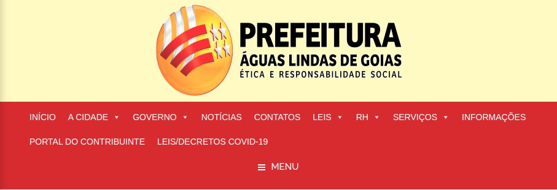

# Características da Plataforma

A plataforma escolhida é uma aplicação web do tipo Portal, onde os usuários podem navegar em busca de informações referentes à Prefeitura de Águas Lindas de Goiás.

## Compatibilidade 

A aplicação é compatível com os principais navegadores disponíveis para Mac, Windows e Linux, porém, apresenta mau funcionamento na versão mobile onde diversos bugs podem ser observados como a falta de resposta ao clicar na opção “menu”. Do ponto de vista do equipamento necessário para utilizar a ferramenta, qualquer computador ligado à internet é o suficiente.

## Funcionalidades

O sistema conta com diversos serviços de informação sobre a Prefeitura e a Cidade de Águas Lindas de Goiás, onde o cidadão pode buscar por:
<li> Informações sobre a Economia </li>
<li> Informações sobre Covid (2020)</li>
<li> Notícias sobre a cidade</li>
<li> Plano diretor da cidade</li>
<li> Serviços</li>
<li> Etc.</li>

## Características negativas

Do ponto de vista de desempenho da interface, a plataforma falha na maioria dos aspectos tanto na versão mobile quanto na versão web, onde botões são mostrados em redundância, quase nenhum feedback visual é empregado causando confusão ao usuário. O tempo de resposta da mudança de página na plataforma varia de uma espera entre média e lenta, tanto na versão web, quanto na versão mobile.

#### Imagens da tela

<h5>Imagem 1 - Erro na disposição dos elementos do menu.</h5>

<h5>Imagem 2 - Elementos ultrapassam os limites da tela e de si mesmos.</h5>

## Referências
+ Livro: BARBOSA, S. D. J.; SILVA, B. S. Interação Humano-Computador. 1ª edição, Rio de Janeiro: Elsevier, 2010.
+ Livro: MAYHEW,  D.J.  The  usability  engineering  lifecycle.  San Francisco, CA: Morgan Kaufmann. 1999. 

## Versionamento
| Data | Versão |           Descrição             |    Autor    |
|:----:|:------:|:-------------------------------:|:-----------:|
|08/10 |V0      |     Criação do documento        |Bruna Almeida|
|12/10 |V1      |   Análise das características da plataforma| Hugo Aragão|
|30/10 |V2      |   Refatoração do documento      | Hugo Aragão|