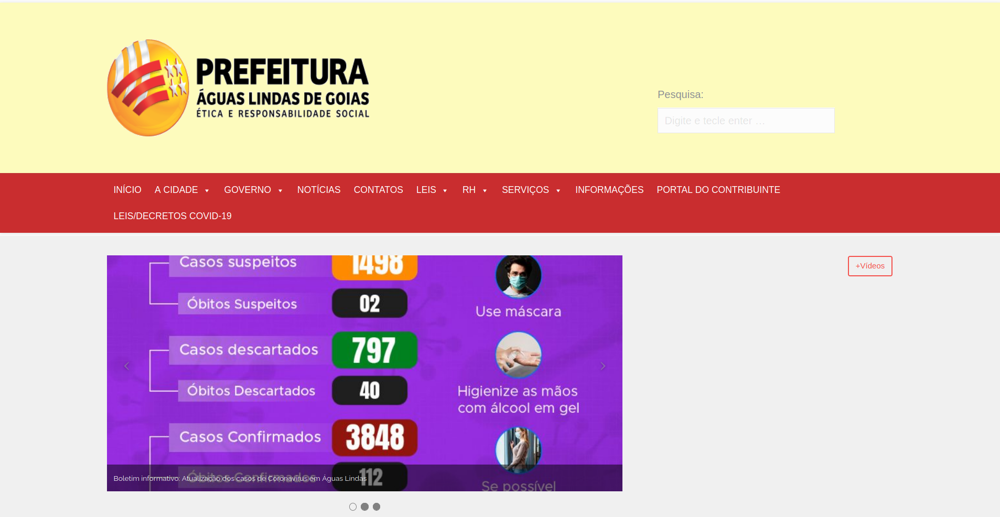
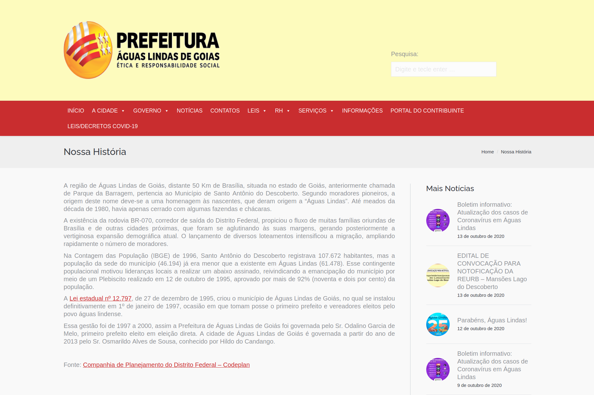
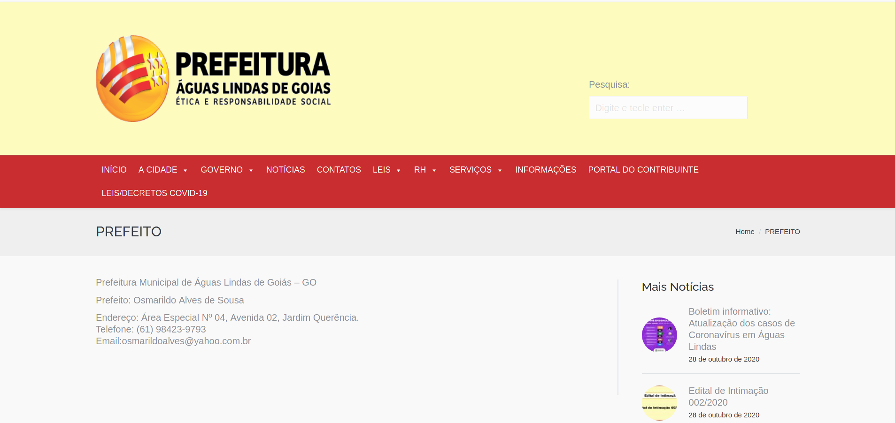
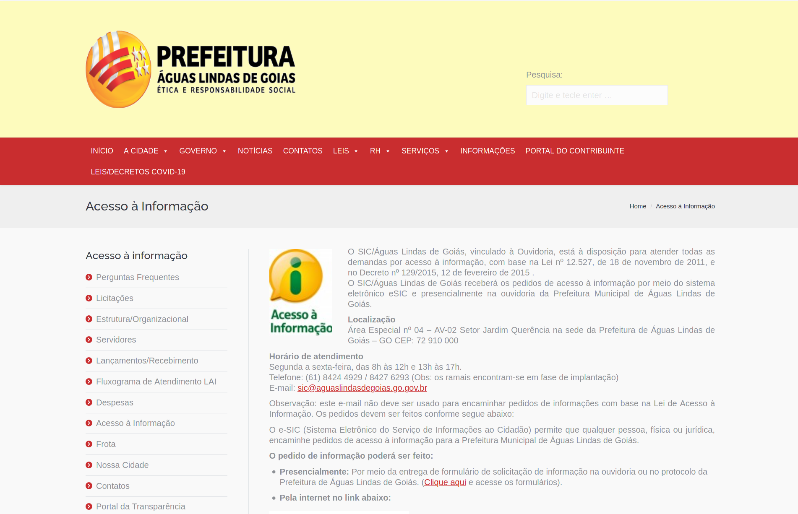
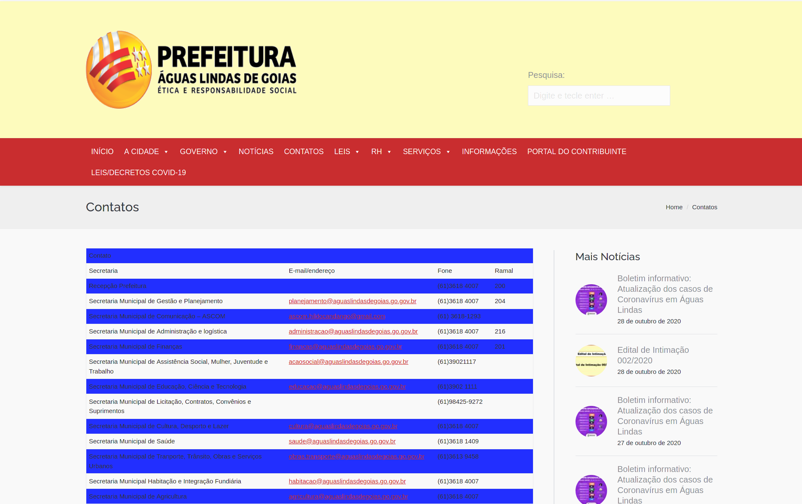
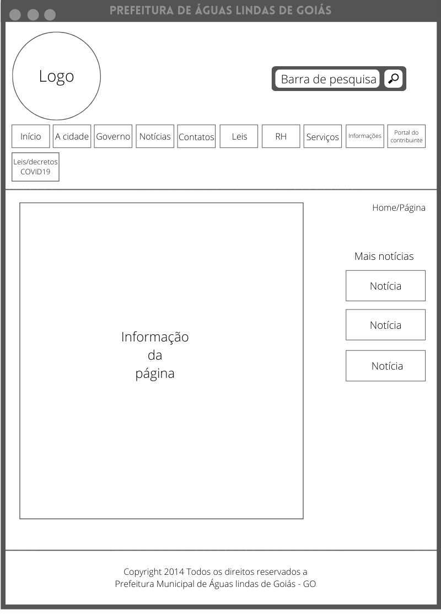
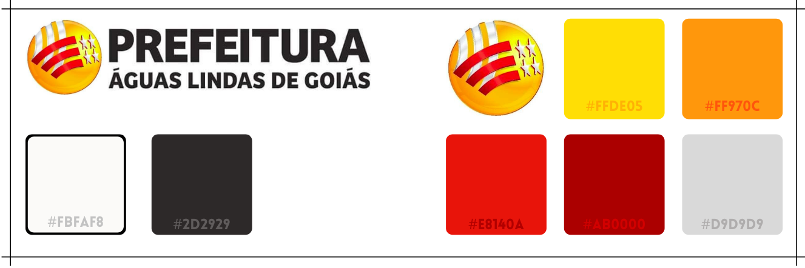
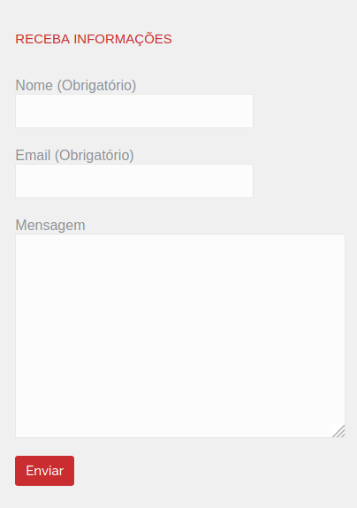

# Guia de estilo

## Definição

O guia de estilo é um registro das principais decisões de design tomadas, de forma que elas não se percam. Guias de estilo servem de ferramenta de comunicação entre os membros da equipe de design e também com a equipe de desenvolvimento. É importante que as decisões de design possam ser facilmente consultadas e reutilizadas nas discussões sobre extensões ou versões futuras do produto. (Barbosa e Silva, 2010)

A imagem a seguir ilustra a fase da engenharia de usabilidade de Mayhew que estamos desenvolvendo.

<figure>

<figcaption>Fig. 1 - Diagrama feito no <a href= "https://app.diagrams.net/">draw.io</a>, baseando-se no diagrama de engenharia de usabilidade de Mayhew.</figcaption>

 
</figure>

Como demonstrado acima, a partir do perfil de usuário, a análise de tarefas, as características da plataforma e os princípios gerais do projeto, é possível definir as metas de usabilidade e, a partir daí, projetar o guia de estilo, que será apresentado seguidamente.

## Participantes
- Bruna Almeida 
- Damarcones Porto

## 1 INTRODUÇÃO
<!--  -->
### 1.1 Objetivo do guia de estilo

O objetivo desse guia de estilo é documentar as características do site avaliado e registrar as principais escolhas de design tomadas pelos desenvolvedores. As informações descritas a seguir serão utilizadas, principalmente, no desenvolvimento de um protótipo. 

### 1.2 Organização e conteúdo do guia de estilo

Este Guia de Estilo está organizado no GitPages, afim de fornecer uma maior clareza sobre a consulta do layout e principais características do site.

### 1.3 Público-alvo do guia de estilos

O público alvo desse guia são os próprios integrantes da equipe, que estão propondo uma reestruturação do site.

### 1.4 Como utilizar o guia

O guia deve ser utilizado como base para as próximas atividades do projeto, especialmente na elaboração do protótipo de melhorias para o site.

### 1.5 Como manter o guia

O guia deve ser atualizado a cada final de fase como indicado por Mayhew, assim torna-se possível sua evolução ao decorrer do desenvolvimento do projeto.

## 2 RESULTADOS DE ANÁLISE
<!--  -->
### 2.1 Descrição do ambiente de trabalho do usuário

Ao acessar o site, o usuário se depara com a tela inicial contendo informações referentes a notícias da cidade de Águas Lindas. Em seguida, é apresentado um menu de funcionalidades disponíveis para o usuário, dentre as quais o usuário pode realizar a tarefa desejada. Esse menu encontra-se também no início da página, em formato de barra. Ao clicar em qualquer uma das opções do menu, o usuário será direcionado para a respectiva aba, e ao lado direito da tela, passam a ser exibidas notícias atualizadas sobre a cidade, sob o título de "Mais notícias".

## 3 ELEMENTOS DE INTERFACE
<!--  -->
### 3.1 Disposição espacial e grid

 O grid está disposto de uma maneira que alguns elementos se confundem com notícias e ícones do menu. Existem ícones de menu fora da barra principal do menu, tornando a  navegação exaustiva. Um espaço do grid que poderia estar preenchida somente com uma cor de fundo, possui um botão com o nome "+vídeos", porém o mesmo leva novamente a tela inicial, causando assim, uma desorientação no usuário. Segue abaixo o grid que foi citado anteriormente: 

<figure>

 
<figcaption>Fig. 2 - Ideia da homepage.</figcaption>
</figure>
 

Agora são apresentadas algumas imagens da tela inicial do site:

<figure>

 
<figcaption>Fig. 3 - Print da homepage.</figcaption>
</figure>

 

<figure>

 
<figcaption>Fig. 4 - Print das notícias na homepage.</figcaption>
</figure>

 

<figure>

 
<figcaption>Fig. 5 - Print dos menus alternativos na homepage.</figcaption>
</figure>
 

### 3.2 Janelas

 O site possui inúmeras janelas. Existem janelas para visualizar notícias, para saber mais sobre a história da cidade, acessar contatos, entre outras janelas. A seguir, encontra-se alguns exemplos de janelas do site.

<figure>

 
<figcaption>Fig. 6 - Exemplo de janela presente no site.</figcaption>
</figure>

<figure>

 
<figcaption>Fig. 7 - Página que mostra dados do atual prefeito.</figcaption>
</figure>

<figure>

 
<figcaption>Fig. 8 - Página de informações..</figcaption>
</figure>

<figure>

 
<figcaption>Fig. 9 - Página dos contatos das secretarias.</figcaption>
</figure>

<figure>

 
<figcaption>Fig. 10 - Página página de notícias da cidade.</figcaption>
</figure>

Para padronizar o modelo de janelas apresentado no site, foi desenvolvido o seguinte grid:

<figure>

 
<figcaption>Fig. 11 - Ideia geral sobre as janelas do site.</figcaption>
</figure>

### 3.3 Tipografia

Em relação à tipografia, o site utiliza as seguintes fontes:

<figure>

<figcaption>Fig. 12 - Tipos de fontes utilizadas no site.</figcaption>
</figure>

### 3.4 Símbolos não tipográficos

O site apresenta os seguintes símbolos:

<figure>

<figcaption>Fig. 13 - Ícones utilizados no site.</figcaption>
</figure>

Esses símbolos representam, respectivamente, os seguintes itens do menu:

- Telefones úteis;

- Portal do aluno;

- Portal saúde - escala médica;

- Agendamento teste - COVID19;

- Portal da transparência;

- Relatórios fiscais;

- Serviços online;

- Licitações.

Os ícones de telefones úteis, portal do aluno e portal da saúde são intuitivos. Já os símbolos para agendamento de teste para COVID19, portal, relatórios fiscais, serviços online e licitações podem deixar o usuário confuso, pois não explicitam exatamente o que significam. O usuário não deduz automaticamente o que pode significar esses símbolos.

### 3.5 Cores

A logo pode ser encontrada de duas formas: com o nome do site por extenso ou apenas sua logo. Aqui está a palheta de cores de ambas as logos:

<figure>

<figcaption>Fig. 114 - Paleta de cores da logo.</figcaption>
</figure>

No percorrer do site as seguintes cores podem ser encontradas:

<figure>

<figcaption>Fig. 15 - Paleta de cores encontrada no site.</figcaption>
</figure>

### 3.6 Animações

Os links para serviços diversos no final da página possuem uma animação, somente após a página ser atualizada, que é ativada assim que a página é rolada para baixo na parte onde estão localizados, o mesmo efeito não é encontrado quando se acessa o site pelo browser do smartphone. 

## 4 ELEMENTOS DE INTERAÇÃO
<!--  -->
### 4.1 Estilos de interação

Os estilos de interação mais utilizados no site são: os de menus, que possibilitam a navegação do usuário pelo site e linguagem natural que indicam onde e o que o usuário pode fazer; WIMP (window, icon, menu, pointing device) que é a utilização de ícones, menus e ações com o mouse; e formulários para aumentar o nível de comunicação com sistema.

### 4.2 Seleção de um estilo

 Como citado anteriormente, o estilo de utilização de menus é o predominante no site. Dessa forma o usuário seleciona o menu e tenta realizar a função contida no menu. 

### 4.3 Aceleradores  (Teclas de atalho)

Não foi encontrado nenhum mecanismo facilitador no uso do site.

## 5 ELEMENTOS DE AÇÃO
<!--  -->
### 5.1 Preenchimento de campos

Para solicitar o recebimento de informações por e-mail, o usuário deve preencher as seguintes informações a seguir, sem isso fica impossibilitado de realizar a ação.

<figure>

 
<figcaption>Fig. 16 - Formulário para recebimento de informações por e-mail.</figcaption>
</figure>

### 5.2 Seleção

Não existe opção de seleção no procedimento anterior.

### 5.3 Ativação

Apos todos os campos preenchidos corretamente, basta o usuário clicar no botão "enviar".

## 6 VOCABULÁRIO E PADRÕES
<!--  -->
### 6.1 Terminologia

A linguagem utilizada no site é bem simples e de fácil entendimento, exceto termos ligados ao poder administrativo, esses não são passíveis de alterações por se tratarem de palavras específicas da administração pública.

### 6.2 Tipos de tela

O site possui uma tela padrão para todas as suas páginas, fora aqueles serviços que são realizados obrigatoriamente fora dele, dando assim, uma sensação de conforto para o usuário por não se deparar com ambientes totalmente desconhecidos.

### 6.3 Sequências de diálogos

Uma mensagem (Sua mensagem foi enviada.) é exibida pelo sistema logo apos o usuário preencher os campos "RECEBA INFORMAÇÕES" e clicar em enviar, isso indica que a operação ocorreu de maneira correta. Nos casos que necessitam algum tipo de confirmação, o sistema informa o usuário com algum aviso na tela do site.

## Referências

- Livro: BARBOSA, S. D. J.; SILVA, B. S. Interação Humano-Computador. 1ª edição, Rio de Janeiro: Elsevier, 2010.

- Todas as imagens apresentadas nessa página foram criadas utilizando o <a href= "https://www.canva.com/pt_br/">Canvas</a>.

- Todos os diagramas apresentados nessa seção, foram criados no <a href= "https://app.diagrams.net/">draw.io</a>.

- Todos os prints apresentados nessa seção, foram retirados do site da <a href= "https://aguaslindasdegoias.go.gov.br/">Prefeitura de Águas Lindas de Goiás</a> nos dias 13 e 28 de Outubro de 2020.

## Versionamento
| Data | Versão |           Descrição             |    Autor    |
|:----:|:------:|:-------------------------------:|:-----------:|
|08/10 |V0      |     Criação do documento        |Bruna Almeida|
|13/10 |V1      |Adiciona strutura para o texto   |Damarcones Porto|
|13/10 |V2      |Adiciona Definição               |Bruna Almeida|
|13/10 |V3      |Adiciona Resultados              |Bruna e Damarcones|
|28/10 |V4      |Adiciona prints do site          |Bruna, Damarcones|
|30/11 |V5      |Corrigi documento                |Bruna, Damarcones|