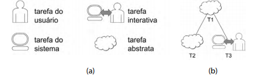
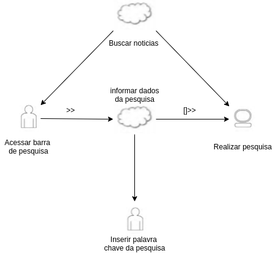

## Definição

### Árvores de Tarefas Concorrentes(ConcurTaskTrees – CTT)

O modelo de árvores de tarefas concorrentes tem como objetivo auxiliar a avaliação e o design e avaliação de IHC.
O modelo propõe as seguintes tarefas: 

- **tarefas do usuário**, realizadas fora do sistema; 
- **tarefas do sistema**, em que o sistema realiza um processamento sem interagir 
  com o usuário; 
- **tarefas interativas**, em que ocorrem os diálogos usuário–sistema;  
- **tarefas abstratas**, que não são tarefas em si, mas sim uma representação de
  uma composição de tarefas que auxilie a decomposição.
    
   

Imagem1 : Tipos de tarefas.
  
Além da hierarquia, o CTT permite representar diversas relações entre as tarefas, que
aumentam a expressividade da notação. Os significados dssas relações são os seguintes:

- **ativação**: T1 >> T2 significa que a segunda tarefa (T2) só pode iniciar após a primeira tarefa (T1) terminar;

- **ativação com passagem de informação**: T1 [ ] >> T2 especifica que, além de T2 só poder ser iniciada após T1, a informação produzida por T1 é passada para T2;

- **tarefas alternativas**: T1 [] T2 especifica duas tarefas que estejam habilitadas num momento, mas que, uma vez que uma delas é iniciada, a outra é desabilitada;

- **tarefas concorrentes**: T1 ||| T2 especifica que as tarefas podem ser realizadas em qualquer ordem ou ao mesmo tempo;

- **tarefas concorrentes e comunicantes**: T1 | [ ] | T2 especifica que, além de as tarefas poderem ser realizadas em qualquer ordem ou ao mesmo tempo, elas podem trocar informações;

- **tarefas independentes**: T1 |=| T2 especifica que as tarefas podem ser realizadas em qualquer ordem, mas quando uma delas é iniciada, precisa terminar para que a outra possa ser iniciada;

- **desativação**: T1 [> T2 especifica que T1 é completamente interrompida por T2;

- **suspensão/retomada**: T1 |> T2 especifica que T1 pode ser interrompida por T2 e é retomada do ponto em que parou assim que T2 terminar.

 
Imagem 2 : Relações entre as tarefas.

## Participantes

- André Eduardo

## Resultados

### CTT01: Buscar notícias

 

## Versionamento

| Data  | Versão |      Descrição       |     Autor     |
| :---: | :----: | :------------------: | :-----------: |
| 01/10 |   V0   | Criação do documento | Bruna Almeida |
| 03/10 |   V1   |  Adição de conteúdo  | André Eduardo |
