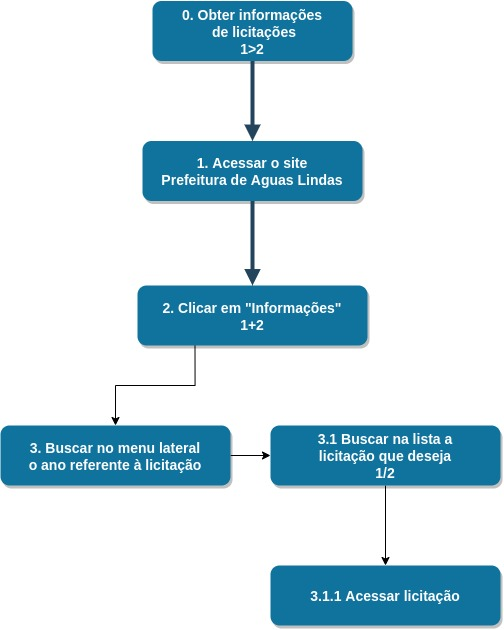

## Definição

Segundo o livro Interação Humano Computador(Simone e Bruno), a Análise Hierárquica de Tarefas (HTA), foi desenvolvida para atender as competências e habilidades exibidas em tarefas complexas não repetitivas, bem como auxiliar na identificação de problemas de desempenho. Essa metodologia traz como conceitos chave:

* Uma **tarefa** é definida como qualquer parte do tabalho a ser realizado.
* Um **objetivo** é um estado específico de coisas, um estado final.
* Um **plano** define os subobjetivos necessários para alcançar um outro objetivo maior, a ordem em que esses subobjetivos devem ser alcançados.
* Uma **operação** é especificada pelas circunstâncias nas quais o objetivo é ativado(_input_ ou _entrada_), pelas atividades ou ações (_actions_) que contribuem para atingi-lo e pelas condições que indicam o seu atingimento (_feedback_).
*  Uma **ação** pode ser entendida como uma instrução para fazer algo sob certas circunstâncias, o _**input**_ como estados e o _**feedback**_ como testes ou avaliação do estado final.

## Participantes
* Hugo Aragão

## Resultados

 
1.Diagrama HTA, para o objetivo de obter informações

## Referências
+ Livro: BARBOSA, S. D. J.; SILVA, B. S. Interação Humano-Computador. 1ª edição, Rio de Janeiro: Elsevier, 2010.

## Versionamento

| Data | Versão |           Descrição             |    Autor    |
|:----:|:------:|:-------------------------------:|:-----------:|
|01/10 |V0      |     Criação do documento        |Bruna Almeida|
|03/10 |V1      |     Análise HTA                |Hugo Aragão  |
