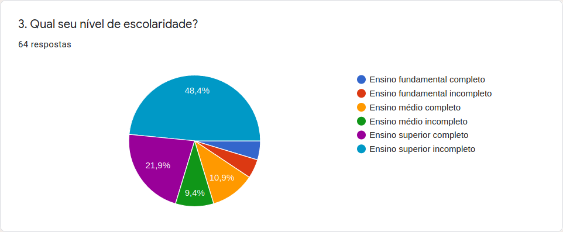
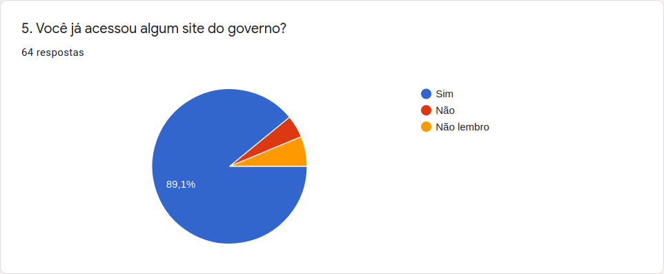
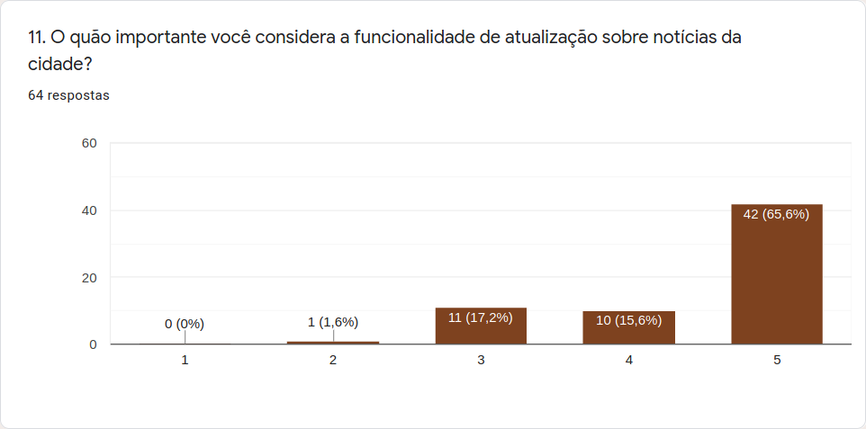
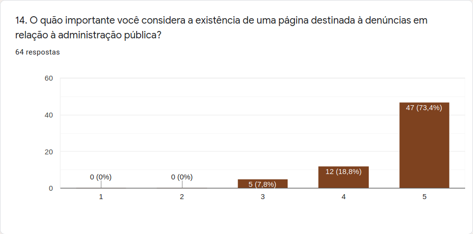
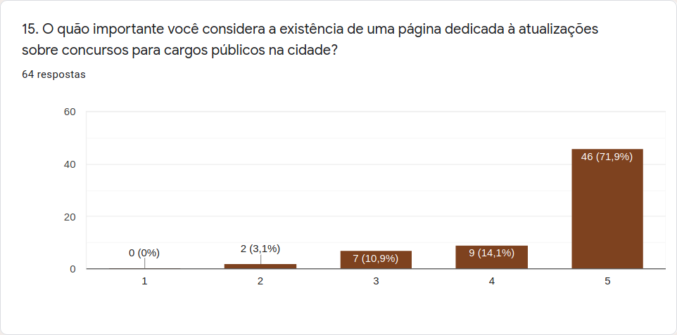

# Questionário

## Definição

Um questionário é um formulário impresso ou on-line com perguntas que os usuários e demais participantes devem responder, a fim de fornecer os dados necessários em uma pesquisa, análise ou avaliação. Os questionários permitem coletar dados de um grande número de pessoas, até mesmo geograficamente dispersas, compondo amostras muito maiores do que com entrevistas ou grupos de foco. Assim como entrevistas, questionários podem conter perguntas abertas e fechadas, mas costumam privilegiar as perguntas fechadas, de preenchimento rápido e de fácil análise. (Barbosa e Silva, 2010)

## Participante(s)

- Damarcones Porto

## Resultados

O questionário foi feito utilizando a plataforma gratuita do Google Forms, e foi aplicado entre os dias 01 e 03 de outubro de 2020, contando com a participação de 64 usuários.

O objetivo do questionário foi realizar um levantamento sobre as funcionalidades que os usuários com o costume de utilizar sites do governo, incluindo sites de prefeituras e administrações regionais, acham mais importantes nesses tipos de ambiente.

### 1. Informações Gerais

Nessa primeira seção, foram coletadas informações básicas sobre os questionados, com o objetivo de criar uma base de um possível perfil de usuários do site avaliado no projeto.

	

         
    

	

         
    

	

         
    

	

         
    

	

         
    

	

         
    

	

         
    

### 2. Opiniões dos Usuários

Nessa seção os questionados puderam dar suas opiniões sobre funcionalidades existentes (ou que poderiam existir) em sites de prefeituras ou administrações regionais, considerando a escala de 1 até 5 para responder às questões, sendo 1 para pouco importante e 5 para muito importante.

	

         
    

	

         
    

	

         
    

	

         
    

	

         
    

	

         
    

	

         
    

	

         
    

 
## Considerações finais

 A partir dos resultados obtidos no questionário, é possível ter uma boa base para a criação de perfis de usuários que comumente utilizam sites de prefeituras, incluindo assim o site da prefeitura de Águas Lindas de Goiás, que é o alvo desse projeto.

A opinião dos usuários sobre algumas funcionalidades também será de bastante relevância no decorrer do desenvolvimento, pois podem ser utilizadas em outras etapas do projeto.  

## Referências

- Livro: BARBOSA, S. D. J.; SILVA, B. S. Interação Humano-Computador. 1ª edição, Rio de Janeiro: Elsevier, 2010.
- O questionário foi desenvolvido na plataforma <a href = "https://www.google.com/intl/pt-BR/forms/about/Google">Google Forms</a>.
- O questionário foi disponibilizado nas redes sociais dos integrantes da equipe Bruna Almeida e Damarcones Porto, e obteve 64 respostas em 3 dias.

## Versionamento

| Data | Versão |           Descrição             |    Autor    |
|:----:|:------:|:-------------------------------:|:-----------:|
|01/10 |V0      |     Criação do documento        |Bruna Almeida|
|03/10 |V1      |Adiciona resultados do questionário| Damarcones Porto|
|30/11 |V2      |Verificação do documento| Damarcones Porto|