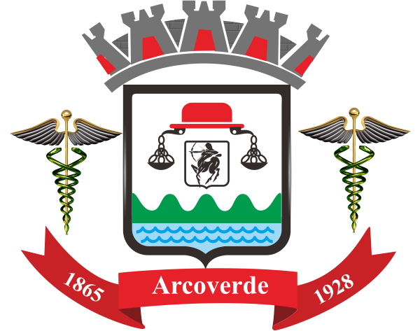

# Sites Avaliados

## FalaBR

{: width=25%; align=left }

O Fala.BR é uma plataforma integrada de ouvidoria e acesso à informação do Governo Federal e está disponível nos endereços eletrônicos:
<a href="https://sistema.ouvidorias.gov.br">sistema.ouvidorias.gov.br</a> e <a href="https://falabr.cgu.gov.br">falabr.cgu.gov.br</a>.

Esse site foi avaliado pela integrante Amanda Bezerra, que pôde detectar problemas principalmente relacionados à falta de consistência e padrões, tratamento inadequado na forma como os usuários devem reconhecer e lidar com os erros e falhas na prevenção de erros.

## Magazine Luiza

{: width=25%; align=left }

O site Magazine Luiza é um marktplace de vendas de produtos variados e está disponível no endereço eletrônico:
<a href="https://www.magazineluiza.com.br/">magazineluiza.com.br</a>.

Esse site foi avaliado pelo integrante André Eduardo.

 
 

## Prefeitura de Águas Lindas de Goiás

{: width=25%; align=left }

O site da Prefeitura de Águas Lindas de Goiás reúne informações institucionais, notícias e serviços online da Prefeitura da cidade de Águas Lindas de Goiás.

Esse site está disponível no endereço eletrônico:
<a href="https://aguaslindasdegoias.go.gov.br/">aguaslindasdegoias.go.gov.br</a> e foi avaliado pela integrante Bruna Almeida.

 

## Prefeitura de Arco Verde

{: width=25%; align=left }

O site da Prefeitura de Arco Verde reúne informações institucionais, notícias e serviços online da Prefeitura da cidade de Arco Verde - PE.

Esse site está disponível no endereço eletrônico:
<a href="http://www.arcoverde.pe.gov.br/">www.arcoverde.pe.gov.br</a> e foi avaliado pelo integrante Damarcones.

 

## Serviços - Governo do Distrito Federal

{: width=25%; align=left }

A Página de Serviços do Governo do Distrito Federal é um site que reúne informações e links dos principais serviços disponibilizados online pelo Governo.

Esse site está disponível no endereço eletrônico:
<a href="http://www.df.gov.br/category/servicos-2/">www.df.gov.br/category/servicos-2</a> e foi avaliado pelo integrante Hugo Aragão.

## Versionamento

| Data | Versão | Descrição | Autor |
|:----:|:----:|:---------:|:-----:|
| 18/09/2020 | 1.0 | Criação da versão 1.0 | Amanda Bezerra |