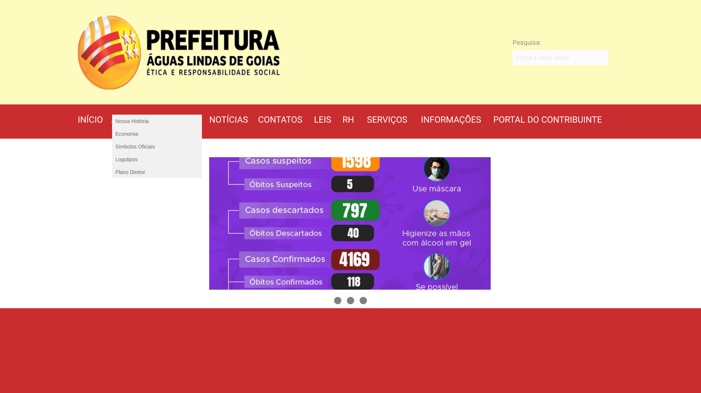
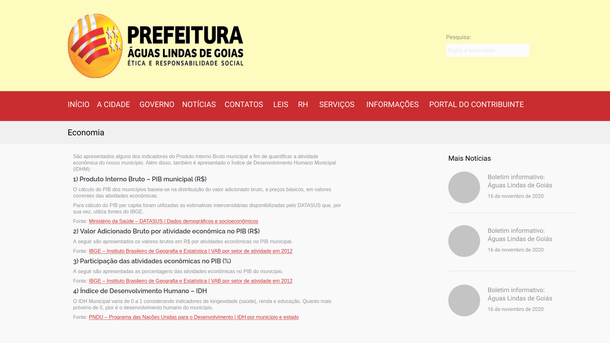

# Protótipo de Alta-Fidelidade: Buscar informações sobre a Economia  

O protótipo de de alta-fidelidade foi desenvolvido na data de 18/11/2020. Ele foi construído com base na tarefa de acessar dados sobre a economia.

## Resultado

 A seguir será apresentado o protótipo de alta-fidelidade.

<figure>

<figcaption>Figura 1. Tela inicial com o a opção 'A Cidade' selecionada.</figcaption>
</figure>

<figure>

<figcaption>Figura 2. Tela das informações sobre a Economia.</figcaption>
</figure>

O protótipo de alta-fidelidade completo pode ser acessado neste <a href="https://www.figma.com/proto/8i5H3SiRpK8UzMh91aa6Ww/IHC---6a-entrega?node-id=26%3A2&scaling=scale-down-width">link</a>.

## Referências

- Livro: BARBOSA, S. D. J.; SILVA, B. S. Interação Humano-Computador. 1ª edição, Rio de Janeiro: Elsevier, 2010.

## Versionamento

| Data | Versão |           Descrição             |    Autor    |
|:----:|:------:|:-------------------------------:|:-----------:|
|18/11 |V0      |     Criação do documento        |Hugo Aragão  |
|18/11 |V1      |  Adiciona protótipo de alta-fidelidade |Hugo Aragão|