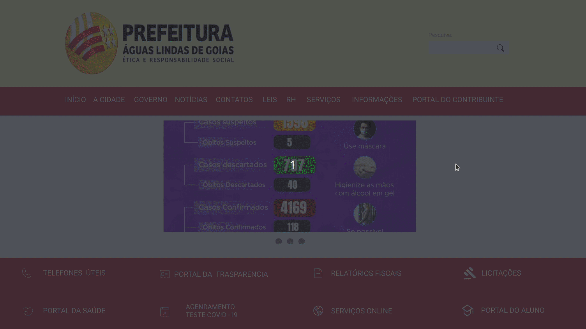

# Protótipo de Alta-Fidelidade: Visualizar boletim de casos de Coronavírus

O protótipo de de alta-fidelidade apresentado a seguir foi desenvolvido utilizando a ferramenta <a href="https://www.figma.com">Figma</a> e visa representar a tarefa "Visualizar boletim de casos de Coronavírus".

## Resultado

As telas a seguir representam a parte do protótipo que correspondem a tarefa em questão.

### Tela inicial

### Tela de notícias

### Parte do detalhamento da notícia

### Resultado final
O GIF a seguir mostra as telas em conjunto:

O protótipo de alta-fidelidade completo pode ser acessado neste <a href="https://www.figma.com/proto/8i5H3SiRpK8UzMh91aa6Ww/IHC---6a-entrega?node-id=26:2&scaling=scale-down-width">link</a>.

## Referências

- Livro: BARBOSA, S. D. J.; SILVA, B. S. Interação Humano-Computador. 1ª edição, Rio de Janeiro: Elsevier, 2010.

## Versionamento

| Data | Versão |           Descrição             |    Autor    |
|:----:|:------:|:-------------------------------:|:-----------:|
|18/11 |V0      |     Criação do documento        |Amanda Bezerra|
|18/11 |V1      |  Adição do conteúdo das seções Protótipo de Alta-Fidelidade,Adição do conteúdo das seções Protótipo de Alta-Fidelidade e Resultado e Referências Resultado e Referências |Amanda Bezerra|