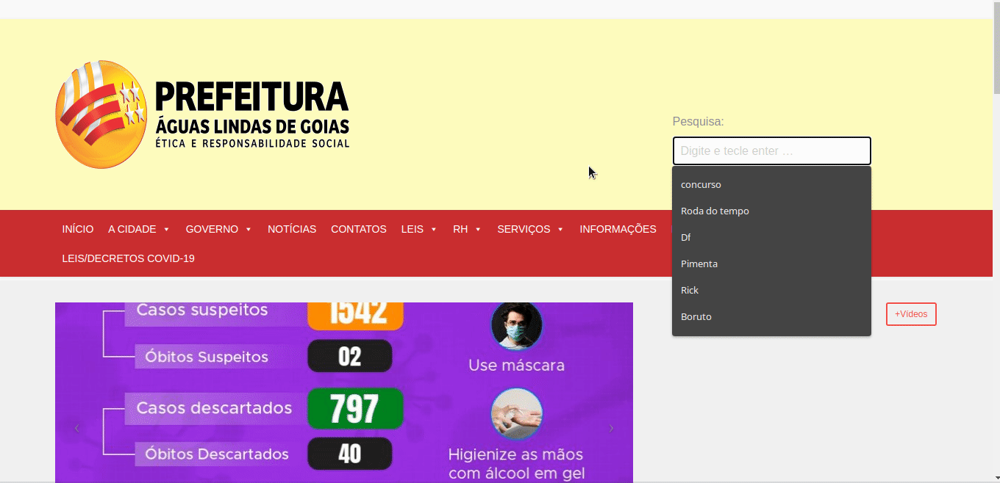

# Teste de usabilidade - Prototipo Buscar no site

## Preparação

A realização dessa avaliação foi foi por meio de uma entrevista realizada de maneira remota com usuário que se enquadra nas características descritas pelas <a href="../perfil_usuario/perfil_personas">Personas</a>

O entrevistado possui as seguintes características: mulher, 23 anos, estudante de arquitetura e moradora de águas lindas.

Não foi possível a gravação em vídeo da entrevista. Por isso apenas os áudios e as capturas de tela da entrevista serão utilizados nessa avaliação

## Coleta de dados

<figure>

 
<figcaption>Fig. 1 - Captura de tela da tarefa realizada entrevistado </a></figcaption>
</figure>
<figure>

 
<figcaption>Fig. 2 - Captura de tela do prototipo analisado pelo entrevistado  </a></figcaption>
</figure>

| Pergunta                                                                                                                           | Resposta         |
| :--------------------------------------------------------------------------------------------------------------------------------- | :--------------- |
| Você encontrou alguma dificuldade na realização do teste ? se sim, qual ?                                                          | <audio controls> |
| Você realizou a mesma tarefa no protótipo de papel e no site avaliado. Qual dos dois você achou mais interessante de se realizar ? | <audio controls> |
| Você tem alguma sugestão ou crítica para a tarefa que foi realizada?                                                               | <audio controls> |

## Interpretação e consolidação dos resultados

A realização do teste seguiu de acordo com as expectativas do avaliador e como foram propostas no planejamento da avaliação, não ocorrendo adversidades durante a entrevista. Sendo possível assim obter dados relevantes para verificação da qualidade do protótipo desenvolvido

## Resultados

Após a análise do avaliador sobre o entrevistado e a revisão do questionário proposto foi possível avaliar a tarefa desenvolvida pelo protótipo. Assim , pode-se observar uma preferência do entrevistado pelo protótipo de papel em relação ao site avaliado, devido a proposta de sugestões de busca com autocomplete que o protótipo inclui na realização da tarefa.

## Referências

- Livro: BARBOSA, S. D. J.; SILVA, B. S. Interação Humano-Computador. 1ª edição, Rio de Janeiro: Elsevier, 2010.

## Versionamento

| Data  | Versão |      Descrição       |     Autor     |
| :---: | :----: | :------------------: | :-----------: |
| 11/10 |   V0   | Criação do documento | Bruna Almeida |
| 11/10 |   V1   |  Adição de conteúdo  | André Eduardo |
