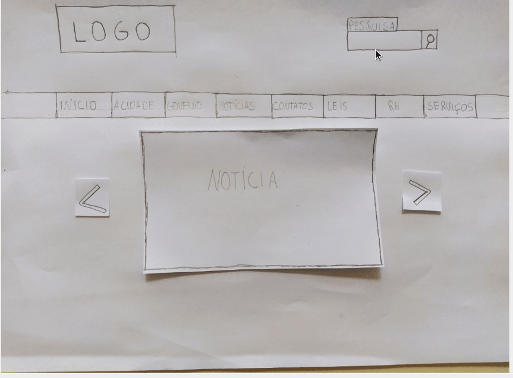

# Avaliação do Protótipo de Papel - Buscar no site

O <i>Framework</i> <b>DECIDE</b> será utilizado para o planejamento da avaliação que será apresentada a seguir.

## Objetivo

A avaliação desse protótipo de papel ajudará a concluir o segundo nível da fase de Design, avaliação e desenvolvimento da Engenharia de Usabilidade de Mayhew.

## Perguntas a serem respondidas

Com os objetivos já estabelecidos, pode-se definir possíveis perguntas a serem utilizadas durante a avaliação:

- As metas de usabilidade foram atingidas?
- A função descrita no protótipo ficou clara?
- A função pode ser melhorada no protótipo?

## Método de avaliação

 O método escolhido para guiar essa avaliação foi o de entrevista.

A  entrevista é uma das técnicas mais utilizadas de coleta de dados. Trata-se de uma conversa guiada por um roteiro de perguntas ou tópicos, na qual um entrevistador busca obter informação de um entrevistado (Seidman, 1998). 

## Questões práticas

A realização dessa avaliação foi foi por meio de uma entrevista realizada de maneira remota com usuário que se enquadra nas características descritas pelas <a href="../perfil_usuario/perfil_personas">Personas</a>

O entrevistado possui as seguintes características: mulher, 23 anos, estudante de arquitetura e moradora de águas lindas.

Não foi possível a gravação em vídeo da entrevista. Por isso apenas os áudios e as capturas de tela da entrevista serão utilizados nessa avaliação

## Questões éticas

Por envolver diretamente um usuário, é necessário apresentar ao entrevistado um termo de consentimento, contendo informações sobre o projeto e sobre como ocorrerá a entrevista.

O termo de consentimento abaixo será apresentado à entrevistada antes de dar início à entrevista:

<object data="../../imagens/TERMO_DE_CONSENTIMENTO_prot_papel.pdf" type="application/pdf" width="700px" height="500px">
<embed src="../../imagens/TERMO_DE_CONSENTIMENTO_prot_papel.pdf">
        
This browser does not support PDFs. Please download the PDF to view it: <a href="../../imagens/TERMO_DE_CONSENTIMENTO_prot_papel.pdf">Download PDF</a>.

    </embed>
</object>
  

Com todo o planejamento já concluído, pode-se dar início à avaliação.

## Avaliação

a entrevistada  foi convidada a participar de um teste de usabilidade, onde lhe foi apresentada às telas feitas em papel, e foi pedido que ela interagisse com as telas a fim de completar a tarefa, em seguida foi proposto que a entrevistada também realizasse a tarefa no site avaliado

<figure>

 
<figcaption>Fig. 1 - Captura de tela da tarefa realizada entrevistado </a></figcaption>
</figure>
<figure>

 
<figcaption>Fig. 2 - Captura de tela do prototipo analisado pelo entrevistado  </a></figcaption>
</figure>

Ao fim do teste, foi feita uma pequena entrevista, que será transcrita a seguir.

## Entrevista

| Pergunta                                                                                                                           | Resposta                                                                                  |
| :--------------------------------------------------------------------------------------------------------------------------------- | :---------------------------------------------------------------------------------------- |
| Você encontrou alguma dificuldade na realização do teste ? se sim, qual ?                                                          | <audio controls><source src="../../imagens/papel/audio_01.mp3" type="audio/mpeg"></audio> |
| Você realizou a mesma tarefa no protótipo de papel e no site avaliado. Qual dos dois você achou mais interessante de se realizar ? | <audio controls><source src="../../imagens/papel/audio_02.mp3" type="audio/mpeg"></audio> |
| Você tem alguma sugestão ou crítica para a tarefa que foi realizada?                                                               | <audio controls><source src="../../imagens/papel/audio_03.mp3" type="audio/mpeg"></audio> |

## Resultados

Após a análise do avaliador sobre a entrevista e a revisão do questionário proposto foi possível avaliar a tarefa desenvolvida pelo protótipo. Assim , pode-se observar uma preferência do entrevistado pelo protótipo de papel em relação ao site avaliado, devido a proposta de sugestões de busca com autocomplete que o protótipo inclui na realização da tarefa.

## Referências

- Livro: BARBOSA, S. D. J.; SILVA, B. S. Interação Humano-Computador. 1ª edição, Rio de Janeiro: Elsevier, 2010.

## Versionamento

| Data  |                Versão                |                Descrição                |     Autor     |
| :---: | :----------------------------------: | :-------------------------------------: | :-----------: |
| 11/10 |                  V0                  |          Criação do documento           | Bruna Almeida |
| 18/10 | <a href="../av_prototipo2_v1">v1</a> |           Adição de conteúdo            | André Eduardo |
| 28/11 |                  v2                  | Refatoração de acordo com a verificação | André Eduardo |
