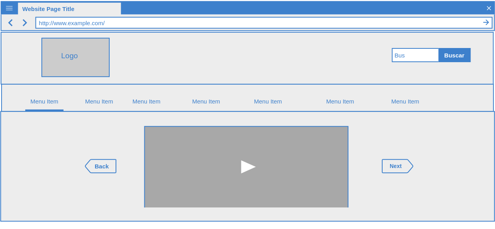
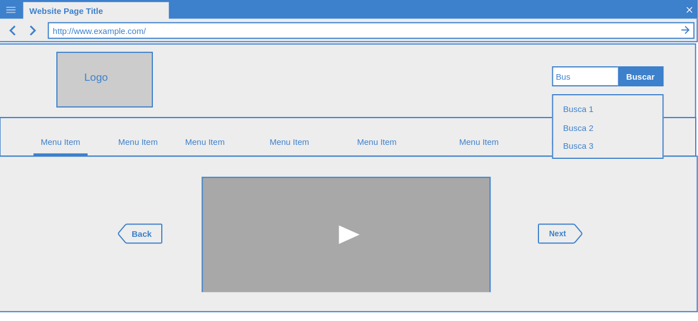
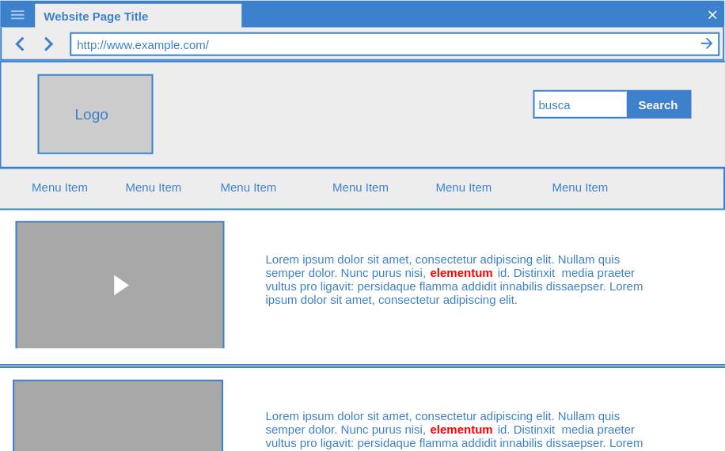

## Telas

 
Protótipo de tela 1: Tela inicial do site da prefeitura de Águas lindas 
Autor:André Eduardo 
 

 
Protótipo de tela 2: Tela inicial do site, com autocomplete com sugestões de busca 
Autor:André Eduardo 
 

 
Protótipo de tela 3: Tela de resultado da busca 
Autor:André Eduardo

## Referências

- Livro: BARBOSA, S. D. J.; SILVA, B. S. Interação Humano-Computador. 1ª edição, Rio de Janeiro: Elsevier, 2010.

## Versionamento

| Data  | Versão |      Descrição       |     Autor     |
| :---: | :----: | :------------------: | :-----------: |
| 11/10 |   V0   | Criação do documento | Bruna Almeida |
| 12/10 |   V1   |  Adição de conteúdo  | André Eduardo |
