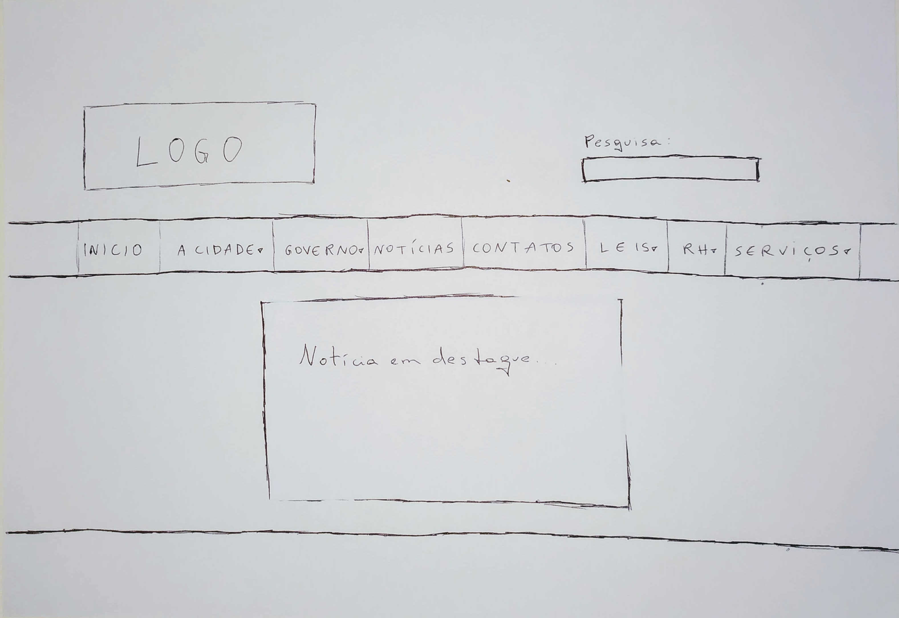
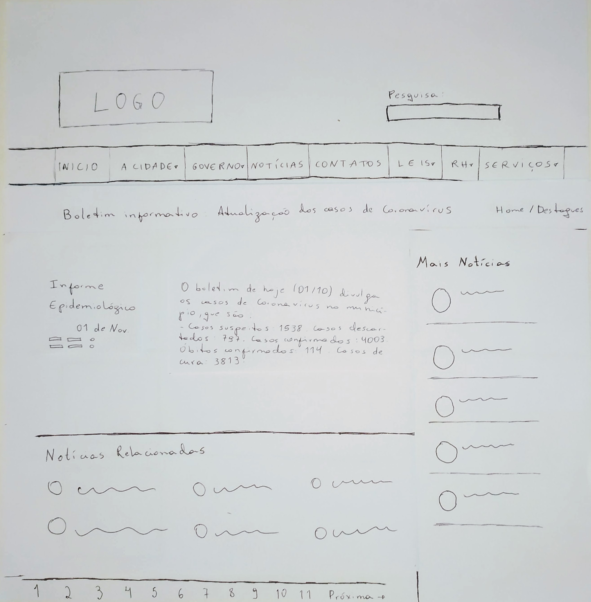

## Introdução
Este protótipo foi criado por Amanda Bezerra para a atividade "Visualizar boletim de casos de Coronavírus de um dia específico".

## Protótipo de Papel

### Peças criadas para realizar interação

### Tela inicial

### Tela de notícias na página 1

### Tela de notícias na página 2

### Tela de detalhamento de notícia

## Referências

- Livro: BARBOSA, S. D. J.; SILVA, B. S. Interação Humano-Computador. 1ª edição, Rio de Janeiro: Elsevier, 2010.

## Versionamento

| Data  | Versão |      Descrição       |     Autor     |
| :---: | :----: | :------------------: | :-----------: |
| 11/10 |   V0   | Criação do documento | Bruna Almeida |
| 12/10 |   V1   |  Adição de das seções Telas e Referências  | André Eduardo |
