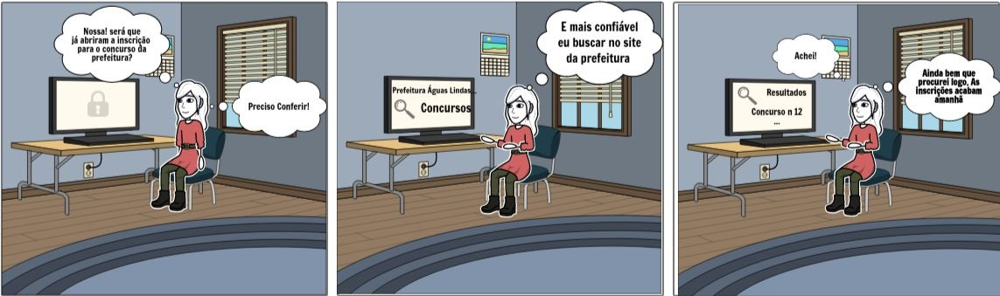

# StoryBoard: Buscar notícias

## Participante(s)

- André Eduardo

<!-- <figure>

 
<figcaption>Fig. n - descricao da imagem</figcaption>
</figure> -->

## Preparo

### Definição das pessoas envolvidas

- Persona: Diana Carvalho

### Definição do ambiente da historia

- Residencia da persona

### Definição da tarefa que será abordada

- Buscar noticias sobre um concurso

## Sequência

### Definição de quais passos estão envolvidos para realização da tarefa

1.  Acessar site da prefeitura de Águas Lindas
2.  Inserir Palavra chave no campo de buscar
3.  Selecionar o resultado desejado.

### Definição do que leva a pessoa a usar a aplicação

Encontrar noticias sobre os concursos da cidade.

### definição de qual tarefa será ilustrada

- A busca por notícias de um concurso, será representada pela personagem buscando notícias de uma fonte confiável sobre quais os concursos disponíveis na sua cidade.

## Satisfaçao

### Definiçao da motivação principal da pessoa que usa a aplicação

- Encontrar de maneira fácil e confiável as principais notícias de concursos da sua cidade

### Definição das realizaçoes que a aplicação permite

- Praticidade e confiabilidade de buscar as notícias relacionas a prefeitura da cidade

### Defição das necessidades que a aplicação se propõe a sanar

- A necessidade de encontrar notícias relevantes sobre os concursos realizados pela cidade, a partir de um fonte confiável
   

 
Autor:André Eduardo

## Referências

Livro: BARBOSA, S. D. J.; SILVA, B. S. Interação Humano-Computador. 1ª edição, Rio de Janeiro: Elsevier, 2010.

## Versionamento

| Data  | Versão |      Descrição       |     Autor     |
| :---: | :----: | :------------------: | :-----------: |
| 20/10 |   V0   | Criação do documento | Bruna Almeida |
| 25/10 |   V1   |  Adição de Conteúdo  | André Eduardo |
