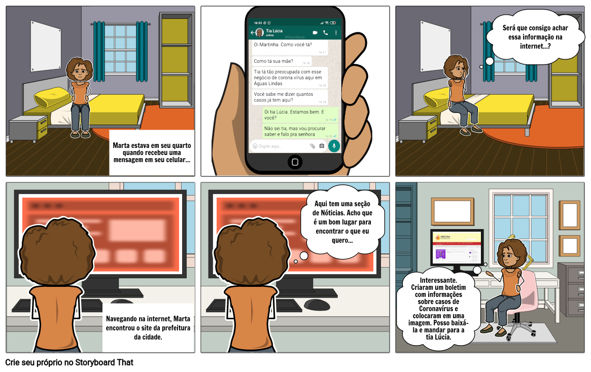

# StoryBoard: Visualizar boletim de casos de Coronavírus

<i>
Criado por Amanda Bezerra em [StoryboardThat](https://www.storyboardthat.com/).
</i>

## Participante(s)
- Amanda Bezerra

## Pessoas envolvidas
Os personagens fictícios a seguir estão envolvidos no Storyboard:

- Marta Sales, estudante de 17 anos e moradora de Águas Lindas de Goiás.
- Lúcia Sales, tia de Marta e também moradora de Águas Lindas de Goiás.

## Ambiente
Casa da personagem Marta Sales.

## Tarefa
Encontrar informação a respeito do número de casos de Coronavírus na cidade de Águas Lindas de Goiás.

## Passos envolvidos
- Acessar a internet
- Acessar o site da Prefeitura de Águas Lindas de Goiás
- Acessar o menu de Notícias
- Localizar o último Boletim de Casos de Coronavírus na cidade

## Motivação para o uso da aplicação
Encontrar uma informação a respeito da cidade de forma rápida utilizando a internet.

## Resultado (satisfação)
Marta, a personagem principal, ficou satisfeita por ter encontrado a informação que queria.

 

## Referências

+ Site da Prefeitura de Águas Lindas de Goiás. Disponível em <https://aguaslindasdegoias.go.gov.br>. Acesso em 24/10/2020.
+ Livro: BARBOSA, S. D. J.; SILVA, B. S. Interação Humano-Computador. 1ª edição, Rio de Janeiro: Elsevier, 2010.

## Versionamento

| Data  | Versão |                                                                           Descrição                                                                           |     Autor      |
| :---: | :----: | :-----------------------------------------------------------------------------------------------------------------------------------------------------------: | :------------: |
| 20/10 |   V0   |                                                                     Criação do documento                                                                      | Bruna Almeida  |
| 26/10 |   V1   | Adição de conteúdo das seções StoryBoard, Pessoas envolvidas, Ambiente, Tarefa, Passos envolvidos, Motivação para o uso da aplicação, Resultado e Referências | Amanda Bezerra |