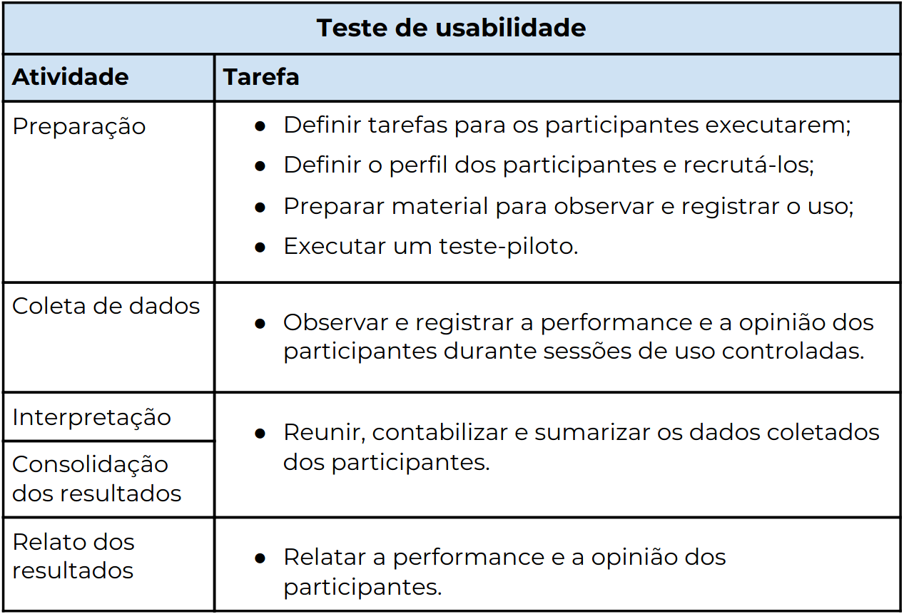

# Planejamento e avaliação - Análise de Tarefas

## Objetivo

O objetivo das avaliações apresentadas a seguir é validar os documentos de análise de tarefas.

As <a href="https://interacao-humano-computador.github.io/2020.1-Prefeiturade-Aguas-Lindas-de-Goias/analise_tarefas/AnaliseTarefas/">análises de tarefas</a> desenvolvidas para o projeto tem como objetivo demonstrar como o usuário utiliza o sistema, destacando os passos que ele segue para concluir determinada tarefa.

## Metodologia

O teste de usabilidade foi escolhido como o método de avaliação. A tabela seguinte apresenta as atividades que devem ser desenvolvidas durante o teste.

<figure>

 
<figcaption>Fig. 1 - Tabela apresentada no livro de Barbosa e Silva: Interação Humano-Computador</a></figcaption>
</figure>

O teste de usabilidade visa a avaliar a usabilidade de um sistema interativo a partir de experiências de uso dos seus usuários-alvo <i>(Rubin, 1994; Rubin e Chisnell, 2008)</i>. Para realizar as medições desejadas, cada integrante convidou um usuário para realizar uma tarefa usando o sistema, no caso o site da <a href="https://aguaslindasdegoias.go.gov.br/">Prefeitura Municipal de Águas Lindas</a>, num ambiente controlado. Durante as experiências de uso observadas, foram registrados vários dados sobre o desempenho dos participantes na realização das tarefas e suas opiniões e sentimentos decorrentes de suas experiências de uso.

## Resultados

Nos testes de usabilidade apresentados a seguir, foram avaliadas as <a href= "https://interacao-humano-computador.github.io/2020.1-Prefeiturade-Aguas-Lindas-de-Goias/analise_tarefas/AnaliseTarefas/">análises das tarefas</a>. Cada integrante aplicou o teste na tarefa que desenvolveu, seguindo os passos descritos na tabela mostrada acima.

- 
<a href="../tu_1">Tarefa: Acessar informações da economia</a>

- 
<a href="../tu_2">Tarefa: Buscar notícias</a>

- 
<a href="../tu_3">Tarefa: Copiar telefone de contato de uma secretaria específica</a>

- 
<a href="../tu_4">Tarefa: Baixar formulário de pessoa física para reclamação</a>

- 
<a href="../tu_5">Tarefa: Visualizar boletim de casos de Coronavírus de um dia específico</a>

## Referências
- Livro: BARBOSA, S. D. J.; SILVA, B. S. Interação Humano-Computador. 1ª edição, Rio de Janeiro: Elsevier, 2010.

## Versionamento

| Data | Versão |           Descrição             |    Autor       |
|:----:|:------:|:-------------------------------:|:--------------:|
|28/10 |V0      |     Criação do documento        |Damarcones Porto|
|29/10 |V1      |Adição da introdução e linkagem  |Bruna Almeida   |
|10/11 |V2      | Refatoração do documento        |Damarcones Porto|